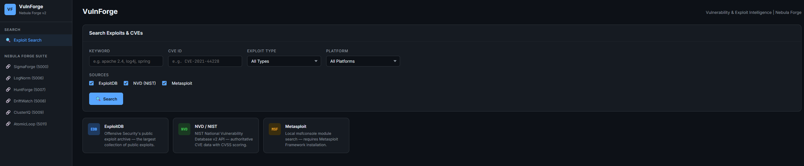
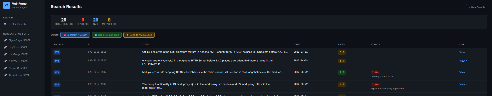

<div align="center">

# VulnForge
 
**Vulnerability & Exploit Intelligence Tool | Nebula Forge Detection Suite v2**
 
[](https://python.org)
[](https://flask.palletsprojects.com)
[](LICENSE)
[](https://github.com/Rootless-Ghost/Nebula-Forge)
 
VulnForge aggregates exploit intelligence from ExploitDB, NVD, and Metasploit, maps findings to MITRE ATT&CK techniques, and feeds results directly into the Nebula Forge purple team pipeline — generating hunt playbooks, LogNorm-ready exports, and AtomicLoop simulation triggers from a single search.
 
---
 
## Overview

</div>
 
VulnForge closes the gap between vulnerability discovery and detection engineering. Search for a CVE or keyword, get back exploit data mapped to ATT&CK techniques, then push that context downstream — straight into HuntForge for playbook generation or AtomicLoop for simulation.
 
**Pipeline position:**
 
```
VulnForge → HuntForge (hunt playbook) → AtomicLoop (simulation) → Wazuh (detection)
```
 
---
 
## Features
 
- **Multi-source search** — ExploitDB, NVD (NIST API v2), and Metasploit in parallel
- **CVE → ATT&CK mapping** — CVE/CWE → CAPEC → ATT&CK technique chaining via `mitreattack-python`
- **LogNorm export** — ECS-lite NDJSON compatible with the LogNorm normalization pipeline
- **HuntForge integration** — Send technique IDs directly to HuntForge for auto-generated hunt playbooks
- **AtomicLoop trigger** — Push ATT&CK technique IDs to AtomicLoop for simulation execution
- **CVSS scoring** — Color-coded severity (Critical / High / Medium / Low)
- **Dark UI** — Nebula Forge dark theme, consistent with the full suite
---

## Screenshots




  


---

## Part of Nebula Forge
 
VulnForge is part of [Nebula Forge](https://github.com/Rootless-Ghost/Nebula-Forge) — an open-source SOC platform covering the full detection engineering workflow.
 
| Tool | Port | Role |
|------|------|------|
| LogNorm | 5006 | Log normalization (ECS-lite) |
| HuntForge | 5007 | ATT&CK hunt playbook generation |
| DriftWatch | 5008 | Sigma rule drift analysis |
| ClusterIQ | 5009 | Alert clustering and triage |
| AtomicLoop | 5011 | Atomic Red Team test runner |
| **VulnForge** | **5012** | **Vulnerability & exploit intelligence** |
 
---

## Installation
 
```bash
git clone https://github.com/Rootless-Ghost/VulnForge.git
cd VulnForge
pip install -r requirements.txt
python app.py
```
 
Access at `http://localhost:5012`

## Usage
 
### Web UI
 
1. Enter a keyword (e.g. `apache 2.4`), CVE ID (e.g. `CVE-2021-44228`), or both
2. Filter by exploit type and platform
3. Select sources: ExploitDB, NVD, Metasploit
4. Click **Search**
5. From results, export to LogNorm, send to HuntForge, or trigger AtomicLoop
### API
 
**Search:**
```bash
curl -X POST http://localhost:5012/api/search \
  -H "Content-Type: application/json" \
  -d '{"keyword": "log4j", "cve": "CVE-2021-44228"}'
```
 
**Export to LogNorm:**
```bash
curl -X POST http://localhost:5012/export/lognorm \
  -H "Content-Type: application/json" \
  -d '{"results": [...]}'
```
 
**Send to HuntForge:**
```bash
curl -X POST http://localhost:5012/export/huntforge \
  -H "Content-Type: application/json" \
  -d '{"technique_id": "T1190", "cve": "CVE-2021-44228"}'
```
 
**Health check:**
```bash
curl http://localhost:5012/health
```
 
---

## ATT&CK Mapping
 
VulnForge maps CVEs to ATT&CK techniques using a chained lookup:
 
```
CVE → NVD CWE tags → CAPEC → ATT&CK Technique
```
 
Results include technique ID, technique name, tactic, and confidence level (high/medium/low). When no mapping is found, `UNKNOWN` is returned rather than silently omitting the field.
 
---
 
## Export Formats
 
### LogNorm NDJSON (ECS-lite)
```json
{
  "event.kind": "vulnerability",
  "cve.id": "CVE-2021-44228",
  "vulnerability.score.base": 10.0,
  "vulnerability.severity": "CRITICAL",
  "threat.technique.id": "T1190",
  "threat.technique.name": "Exploit Public-Facing Application",
  "threat.tactic.name": "Initial Access",
  "source.tool": "VulnForge",
  "@timestamp": "2026-04-15T00:00:00Z"
}
```
 
---
 
## Requirements
 
- Python 3.10+
- `flask`, `requests`, `beautifulsoup4`, `mitreattack-python`
- Metasploit Framework (optional — graceful fallback if not installed)
- HuntForge on port 5007 (optional — offline-safe)
- AtomicLoop on port 5011 (optional — offline-safe)
---

## Responsible Use
 
VulnForge is intended for authorized security testing, detection engineering, and purple team operations. Do not use against systems you do not own or have explicit written permission to test.

## License

This project is licensed under the MIT License — see the [LICENSE](LICENSE) file for details.


<div align="center">

Built by [Rootless-Ghost](https://github.com/Rootless-Ghost) 

</div>

